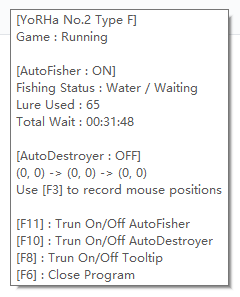

# trove-autofisher

This is an auto-fisher for Trove.

**NOTICE**: It's designed for **only chinese version** of game.

So don't waste your time on try it with steam/glyph version.

But feel free to modify the memory pointer location to make it work for steam/glyph version

## Other

This work's idea is originally from howar31/Trove-AHK-AutoFish

I rewrite most of its logic and re-found the MPL for chinese version game

Besides, you can use **ALT+Q** as a bosskey functionality
